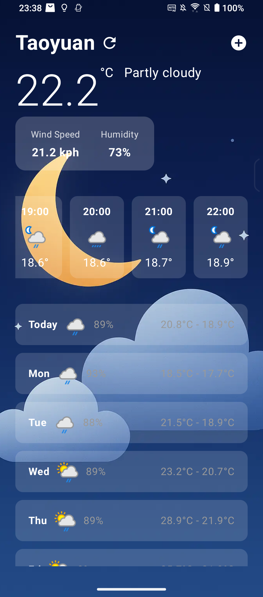
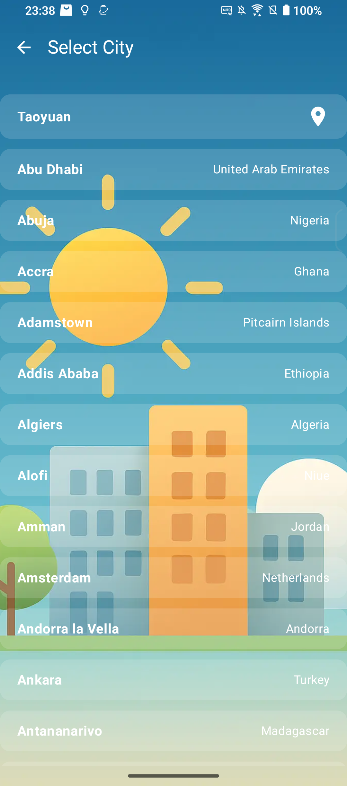

# City Weather

## Screenshot

    
    
  

## Development Environment
- MacBook Pro (Apple M2 Pro)
- Android Studio Narwhal Feature Drop | 2025.1.2 Patch 1
  
## Android Configuration
- Compile SDK: 36
- Min SDK: 26
- Target SDK: 36
- Kotlin: 2.2.21
- Java: 11

## Requirements
- Displaying the weather forecast for the current day.
- Displaying the weather forecast for the next 24 hours.
- Displaying the weather forecast for the week.
- A city list where users can select a city to view its weather forecast information.

## Libraries and Tools

### UI Framework
- Jetpack Compose - Modern Android UI framework
- Activity Compose - Compose and Activity integration
- ViewModel Compose - UI state management
- Navigation Compose — Used for page navigation and animations.

### Network
- Retrofit - HTTP client
- OkHttp - Network request implementation
- Gson - JSON serialization/deserialization

### Dependency Injection
- Koin - Dependency injection framework
- Koin Compose - Koin and Compose integration

### Image Loading
- Coil Compose - Image loading library

### Development Tools
- Startup Runtime - Application startup initialization

### AI
- CharGPT - An AI developed by OpenAI, mainly for generating images and performing simple syntax queries.
- Gemini - An AI developed by Google, mainly used for handling bugs, designing Compose components, and related tasks.

### Other
- Postman - API testing tool for testing API requests
